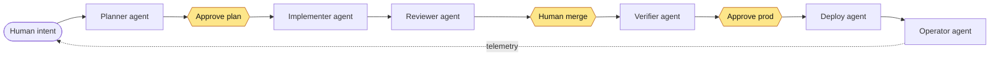
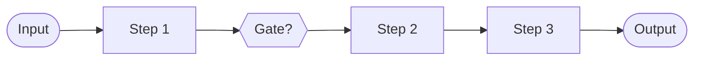
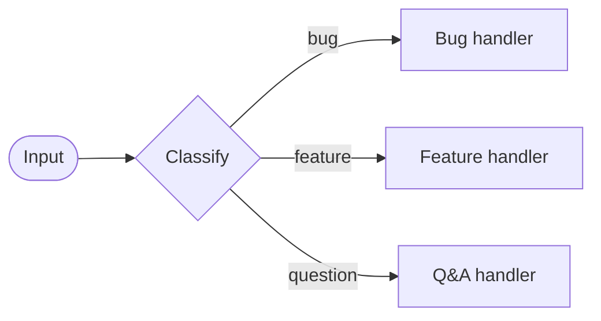
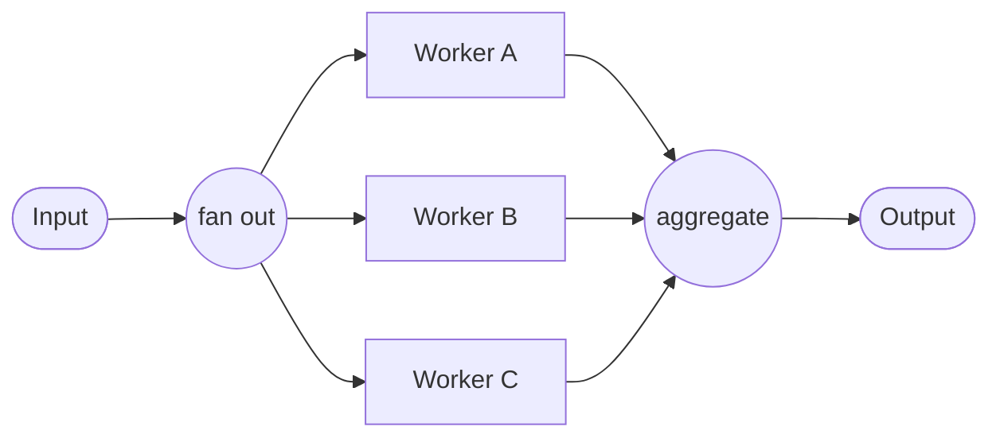
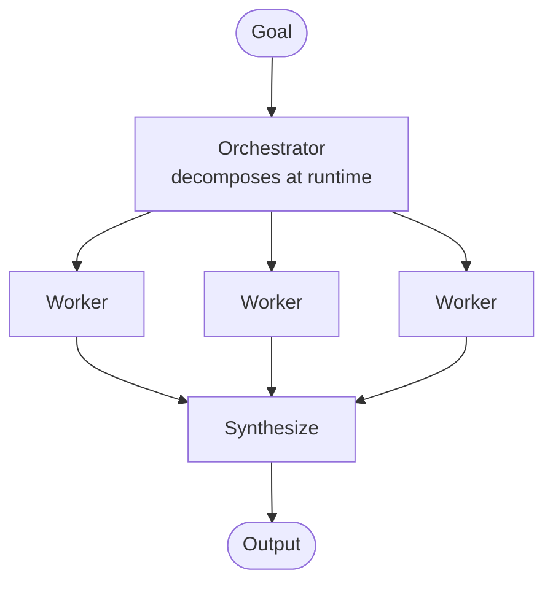
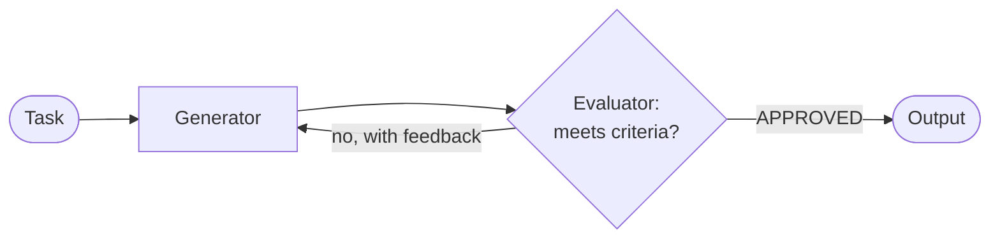
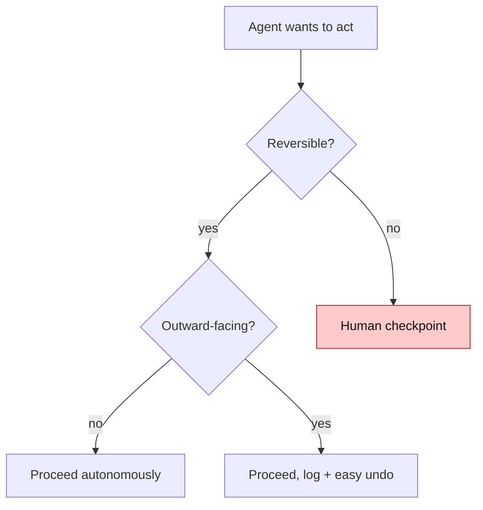

# Diagrams

Visual companions to the guides. GitHub renders Mermaid in Markdown natively, so these display inline on the repo.

## The agentic SDLC loop

Agents execute; humans hold the gates (◆). Operational findings feed back into the next plan.

## The five orchestration workflows

Ordered by increasing complexity — use the least complex one that solves your problem. See the [pattern catalog](./patterns/) for code.

### 1. Prompt chaining

### 2. Routing

### 3. Parallelization

### 4. Orchestrator-workers

### 5. Evaluator-optimizer

## Guardrails by blast radius

See [governance & metrics](./governance-and-metrics.md#guardrails-design-for-the-blast-radius).
